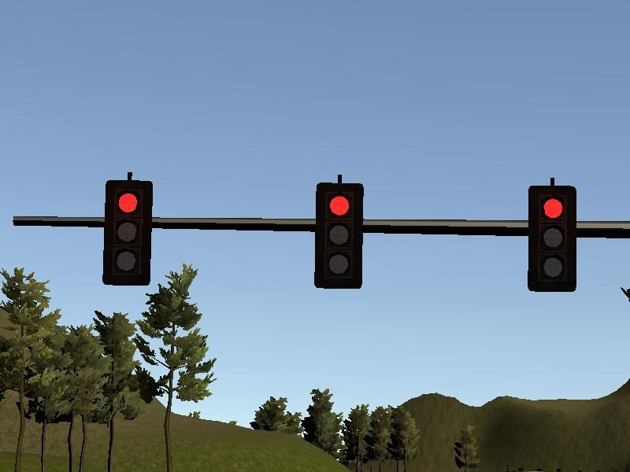
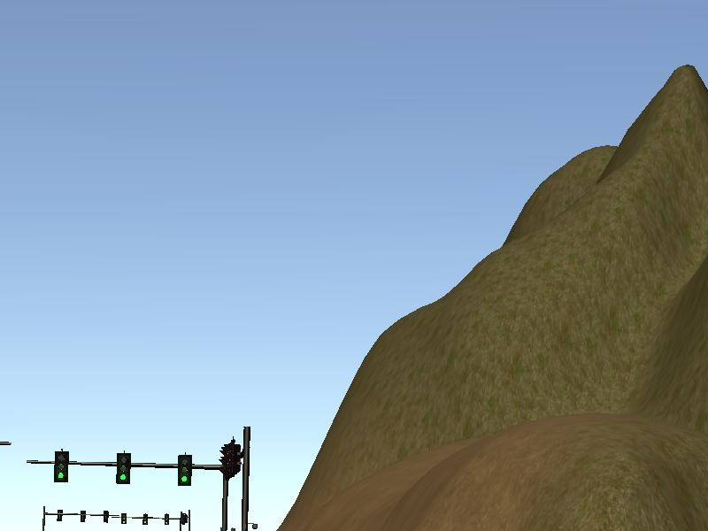
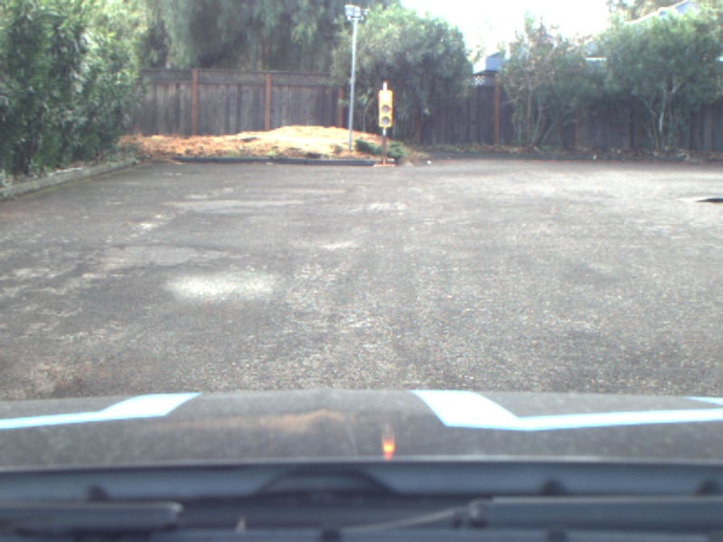
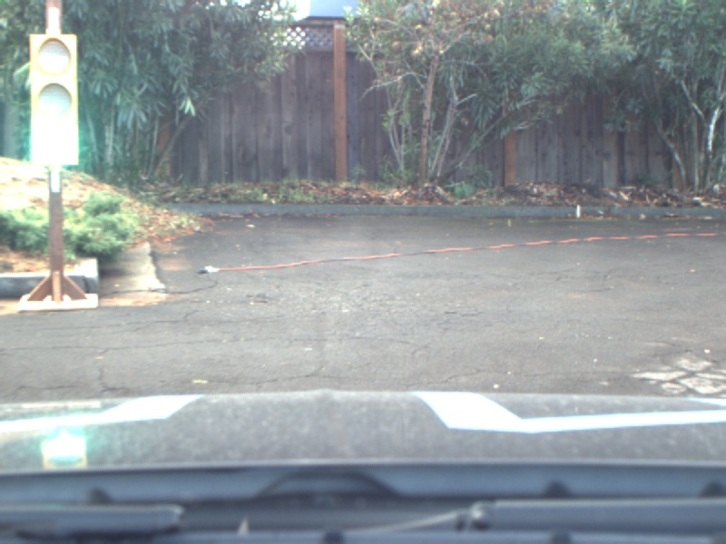
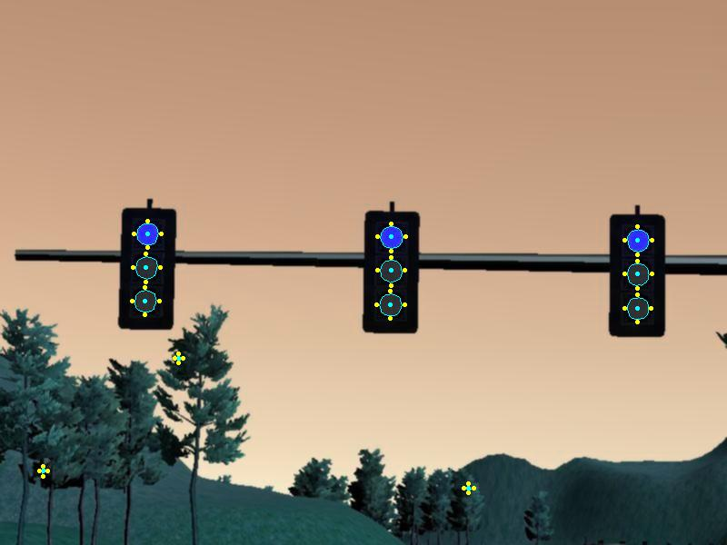
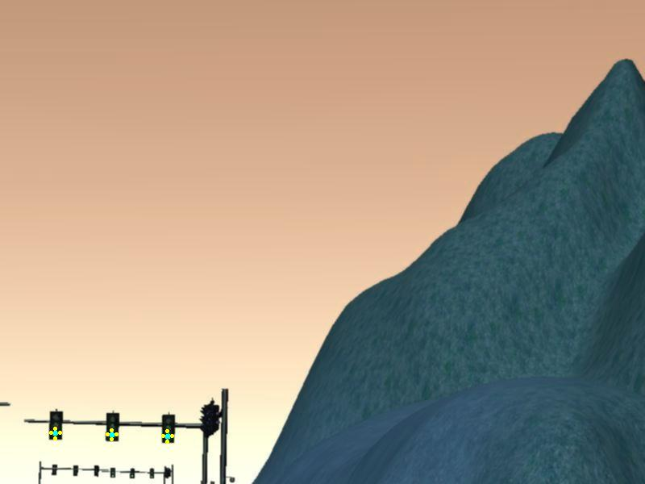
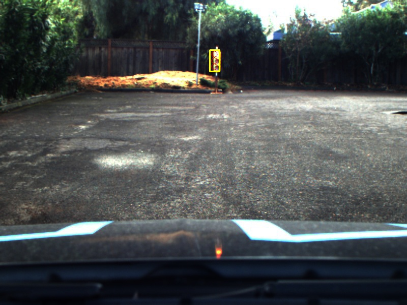
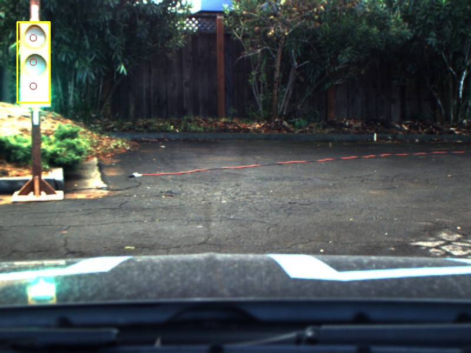

This is the project repo for the final project of the Udacity Self-Driving Car Nanodegree: Programming a Real Self-Driving Car. For more information about the project, see the project introduction [here](https://classroom.udacity.com/nanodegrees/nd013/parts/6047fe34-d93c-4f50-8336-b70ef10cb4b2/modules/e1a23b06-329a-4684-a717-ad476f0d8dff/lessons/462c933d-9f24-42d3-8bdc-a08a5fc866e4/concepts/5ab4b122-83e6-436d-850f-9f4d26627fd9).

While Udacity allows both native or virtual machine/docker installation, latency issues have been observed with VM's, so please use a native installation on Linux to run this project.

### Native Installation

* Be sure that your workstation is running Ubuntu 16.04 Xenial Xerus or Ubuntu 14.04 Trusty Tahir. [Ubuntu downloads can be found here](https://www.ubuntu.com/download/desktop).

* Follow these instructions to install ROS
  * [ROS Kinetic](http://wiki.ros.org/kinetic/Installation/Ubuntu) if you have Ubuntu 16.04.
  * [ROS Indigo](http://wiki.ros.org/indigo/Installation/Ubuntu) if you have Ubuntu 14.04.
* [Dataspeed DBW](https://bitbucket.org/DataspeedInc/dbw_mkz_ros)
  * Use this option to install the SDK on a workstation that already has ROS installed: [One Line SDK Install (binary)](https://bitbucket.org/DataspeedInc/dbw_mkz_ros/src/81e63fcc335d7b64139d7482017d6a97b405e250/ROS_SETUP.md?fileviewer=file-view-default)
* Download the [Udacity Simulator](https://github.com/udacity/CarND-Capstone/releases).

### Usage

1. Clone the project repository
```bash
git clone https://github.com/briansfma/CarND-Capstone.git
```

2. Install python dependencies
```bash
cd CarND-Capstone
pip install -r requirements.txt
```
3. Once the Object Detection API is set up, make and run styx
```bash
cd ../../../.. (or cd CarND-Capstone/ros)
catkin_make
source devel/setup.sh
roslaunch launch/styx.launch
```
4. Run the simulator

### Real world testing

1. Download [training bag](https://s3-us-west-1.amazonaws.com/udacity-selfdrivingcar/traffic_light_bag_file.zip) that was recorded on the Udacity self-driving car.
2. Unzip the file
```bash
unzip traffic_light_bag_file.zip
```
3. Play the bag file
```bash
rosbag play -l traffic_light_bag_file/traffic_light_training.bag
```
4. Launch your project in site mode
```bash
cd CarND-Capstone/ros
roslaunch launch/site.launch
```
5. Confirm that traffic light detection works on real life images

### Methods

This project implements ROS nodes to drive an autonomous vehicle in the Udacity simulator. The nodes are organized into three subsystems:

1. Waypoint Finder (Updater)
2. Motion Controller
3. Traffic Light Detector

In the first, the Waypoint Finder reads a map provided by the simulator, calculates where the car is on the map, and outputs a list of waypoints (position X/Y and target speed) to the Motion Controller to follow. The Waypoint Finder also receives information from the Traffic Light Detector regarding upcoming signals (Go / No Go) and adjusts target speed accordingly.

In the second, the Motion Controller receives the waypoints, calculates where the car is along the waypoints, and outputs commands to the car's DBW module to make the car follow the waypoints faithfully, at the target speed, and without comfortable accelerations left/right or forward/backward.

Lastly, the Traffic Light Detector reads known traffic light positions based on the map provided by the simulator, identifies whether the light is Red/Yellow/Green based on the image seen by the car's camera, and outputs to the Waypoint Finder whether to cross the intersection or not.

The most difficult part of this project is the image processing, as the `base_waypoints` map provided by the simulator makes path planning and motion control mostly straightforward. Traffic lights are small objects in a car's camera view, so whether conventional image processing or machine learning is used to identify them, speed and robustness are a challenge. Some examples below, from both simulator output and the Udacity test lot:

  
 

I found that a pure OpenCV approach could be used to classify traffic lights in the simulator - while less applicable to real world, it worked much faster than a neural network with limited hardware resources on my local machine.

 

The approach can be summed up as follows: 1) find edges, 2) find contours, 3) filter closed contours by circularity, 4) filter circles by center brightness relative to outside, 5) average the pixel values within the remaining circles. The car is able to accurately classify traffic lights from hundreds of meters away like this.

Obviously, this does not work on real-life images, with varying degrees of tint, washed out colors, or sensor saturation, so Tensorflow's Object Detection API was employed to find the traffic lights in the image, before using OpenCV for final classification.

 

This approach can be summed up as follows: 1) find all "Traffic Light" detections in an image via Faster RCNN Inception V2, 2) filter out detections based on score and window dimensions, 3) within each detection, take three spot samples in locations corresponding to Red, Yellow and Green lights, 4) find the brightest spot. While this approach is slower than pure OpenCV, the Faster-RCNN is much more robust at figuring out where traffic lights are, and the remaining operations can be done quickly via array arithmetic. In a machine with sufficient computing power, this approach would be the way to go without the need for arduous neural network training.

With that said, neither approach would be very effective if the traffic lights do not abide by the vertical Red/Yellow/Green pattern, so code would either need to be re-written, or the Faster-RCNN would indeed have to be re-trained for new data.

### Other library/driver information
Outside of `requirements.txt`, here is information on other driver/library versions used in the simulator and Carla:

Specific to these libraries, the simulator grader and Carla use the following:

|        | Simulator | Carla  |
| :-----------: |:-------------:| :-----:|
| Nvidia driver | 384.130 | 384.130 |
| CUDA | 8.0.61 | 8.0.61 |
| cuDNN | 6.0.21 | 6.0.21 |
| TensorRT | N/A | N/A |
| OpenCV | 3.2.0-dev | 2.4.8 |
| OpenMP | N/A | N/A |

We are working on a fix to line up the OpenCV versions between the two.
